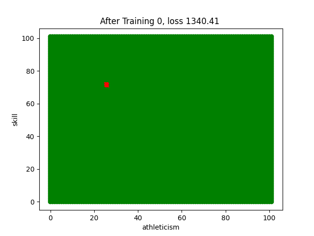
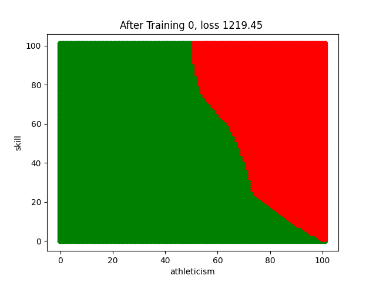

# Machine Learn : Linear Regression 
## Written By 練鈞揚 😎
### Py env : Anaconda Py3.11 🐍

---
### File Type
File using : ipyhb 

---

### How to run 🏃

Open in vscode , set the core to be anaconda env = py 3.11 
and run all 

---

### Result 
You can get `gif` of different Part , Here is the gif file example

#### Part I

#### Part II

